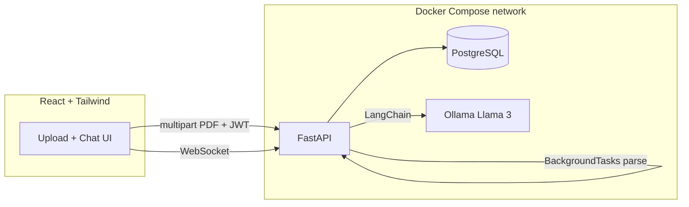

# AI Mock Interview Platform

Upload a PDF resume, extract and semantically expand skills with a local Llama 3 model, then run a token-streaming mock interview. The application keeps interview answers, AI feedback, scores, and session history so a user can return to a completed interview.

## Architecture



One FastAPI process owns auth, uploads, background parsing, Postgres writes, and WebSockets. There is no extra gateway, Celery, or Redis.

## Setup

### 1. Environment

```bash
cp .env.example .env
```

Set `SECRET_KEY` to a long random string before any real use.

### 2. Start backend, Postgres, and Ollama

```bash
cd infra
docker compose up --build
```

Wait until `interview-backend` is healthy. First Ollama pull is separate:

```bash
docker compose exec ollama ollama pull llama3
```

The embedding model (`EMBEDDING_MODEL`, default `sentence-transformers/all-MiniLM-L6-v2`) downloads on first resume parse.

### 3. Frontend

```bash
cd frontend
npm install
npm run dev
```

Open http://localhost:5173. The UI talks to http://localhost:8000 (override with `VITE_API_BASE` / `VITE_WS_URL`).

### 4. Health check

```bash
curl http://localhost:8000/health
```

Expected: `{"status":"ok"}`.

## API sketch

| Method | Path | Auth | Notes |
| --- | --- | --- | --- |
| GET | `/health` | no | Docker healthcheck |
| POST | `/auth/register` | no | bcrypt password |
| POST | `/auth/login` | no | access (~15m) + refresh token |
| POST | `/auth/refresh` | refresh | rotate pair and revoke the prior refresh token |
| POST | `/auth/logout` | no | revoke the supplied refresh token |
| GET | `/auth/me` | JWT | |
| POST | `/resumes` | JWT | 202, BackgroundTask parse |
| GET / DELETE | `/resumes` / `/resumes/{id}` | JWT | status + skills / delete owned resume |
| POST | `/interviews` | JWT | strict JSON questions |
| GET | `/interviews` / `/interviews/{id}` | JWT | owned session history and transcript |
| POST | `/interviews/{id}/end` | JWT | close an interview |
| WS | `/ws/notifications?token=` | JWT query | `resume_ready` / `resume_failed` |
| WS | `/ws/interview/{id}?token=` | JWT query | `token` stream per answer |

Upload, interview, login, and registration endpoints are rate-limited. Browser WebSockets authenticate via a WebSocket subprotocol rather than placing an access token in the URL.

`PARSE_MODE=dummy` skips Ollama during resume parse (useful before the model is pulled). Interview chat still needs Llama 3.

## Resume pipeline

1. Client uploads PDF with a Bearer token.
2. FastAPI stores the file, inserts `resumes.parsed_status=pending`, returns **202**.
3. `BackgroundTasks` runs `process_resume_job`: PyPDF2 text → LangChain + Pydantic parser for skills → sentence-transformer cosine match against a local skill ontology → rows in `skills`.
4. Status becomes `done` or `failed` (up to 2 retries). The API pushes a WebSocket event to that user.

Uploads must be genuine PDF files and are limited by `MAX_UPLOAD_SIZE_MB` (10 MB by default). API responses expose only a safe stored filename, never the server's upload path.

## Interview pipeline

Questions are forced into `{"question","ideal_answer_concept"}` via `PydanticOutputParser`. A malformed model reply is re-prompted once with the parser error. Live answers stream token-by-token over the interview WebSocket; disconnect cancels the in-flight generation task.

## At Production Scale

This codebase is sized for a college demo (one API process, in-process background jobs, a single Postgres). Under real traffic you would swap:

- **BackgroundTasks → Celery + Redis workers** so resume parse and embeddings do not share the API process or disappear if a replica restarts mid-job. Redis (or another broker) would hold the queue; workers could autoscale independently.
- **Single FastAPI service → API gateway + AI microservice** so JWT/upload/CRUD stay cheap and horizontally scaled, while Ollama/LangChain calls live behind a dedicated AI service with its own timeouts, GPU nodes, and backpressure.
- **Single Postgres instance → replicated / managed database** (primary for writes, read replicas for session/history reads, automated backups, connection pooling). Job status would still live in SQL, but you would add idempotent worker keys so retries cannot double-write skills.

Keep the product flow the same; only the isolation boundaries change.

## Repo layout

```
/frontend   React + Vite + Tailwind
/backend    FastAPI app
/infra      docker-compose.yml, init.sql
.env.example
README.md
```

## Development checks

```bash
cd backend
# Use Python 3.11, the version used by the backend Docker image.
python -m pip install -r requirements.txt
pytest
ruff check app tests

cd ../frontend
npm install
npm run build
```

Do not use the sample `SECRET_KEY` outside local development. The backend applies a small compatibility migration at startup for older databases; use a managed migration tool before a multi-instance production rollout.
